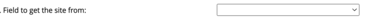
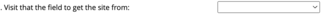
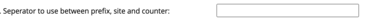

# REDCap_LabelGenerator
Generate labels for use in REDCap projects.

If you wish to identify records by a label other than the REDCap Record ID, or you would like to label SAE forms etc 
separately then this module is for you.

The module facilitates the use of multiple labels within a project on or across multiple forms.

The format of the label is of the form

```
<Prefix><seperator><site identifier><seperator><counter>
```
* The site identifier need not be used.
* The counter can be specified to be within site or within study.
* The counter's range can also be specified (i.e. the degree of padding).
* The counter is based on the number of fields with a value in them, so if a field is removed the counter will reset and you could end up with duplicate labels.

## Configuration
All configuration is undertaken from the External Modules - Project Module Manager.

The following instructions assume that the module has been enabled for your project.

1. Access the "External Modules - Project Module Manager" page.
2. Click on the "Configure button"
3. You will then see the following screen
   
 

| Section                             | Purpose                                                                                                           |
|-------------------------------------|-------------------------------------------------------------------------------------------------------------------|
|  | Button to add a second/third .... instance                                                                        |
|  | Should the label be added on form load or form save                                                               |
|  | Which form is the label to be added too.                                                                          |
|  | Which visit is the form located at.                                                                               |
|  | What prefix to use (optional).                                                                                    |
|  | If you wish to have a different identifier per site, list the mapping here (leave blank if not mapping to sites). |
|  | Which field holds the site identifier (leave blank if not mapping to sites).                                      |
|  | At which visit is the site identifier found (leave blank if not mapping to sites).                                |
|  | What separator do you wish to use (optional).                                                                               |
|  | Do you wish the counter to be sequential in site of in the whole study.                                           |
|  | Number of digits to use (will left pad with zeros).                                                               |
|  | The field to count instances with text in (this is also the field that the label will be inserted into).          |
|  | The visit that the previous field is found at.                                                                    |


# Changelog

| Version | Date        | Description |
| ------- |-------------| ----------- |
| 1.0 | 07 Mar 2025 | Intial release |

